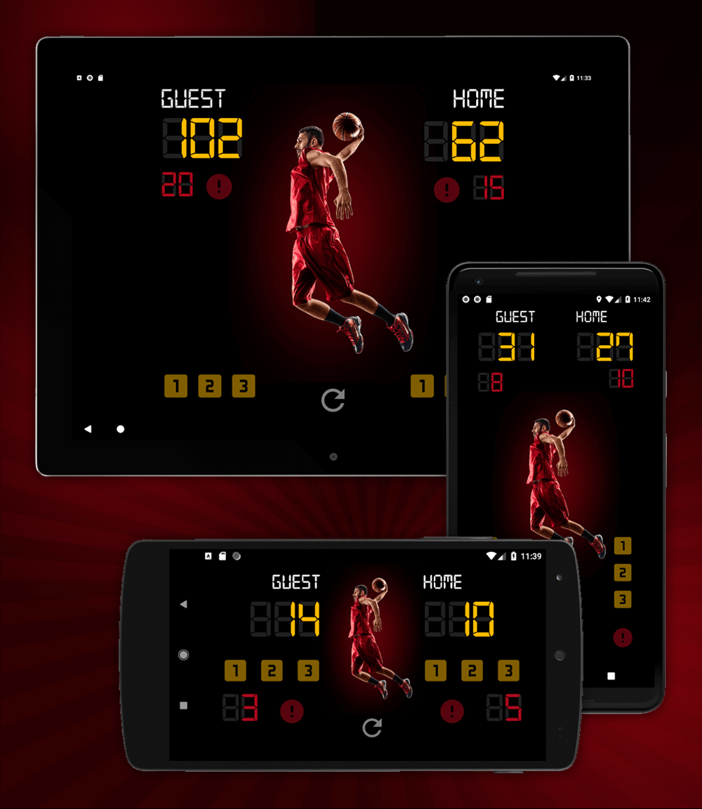

## Score Keeper App for Grow With Google Udacity Nanodegree - Android Basics
# Basket Ball Court Counter II

_**API 23: Android 6.0 (Marshmallow)**_

## Screenshots

## Additional Features
1. Portrait and landscape views for phones
2. Portrait and landscape views for tablets
3. Saves TextView states after rotation
4. Custom non-Google fonts for the scoreboard
5. App Icon

## Resources
* [Digital 7 Font](http://www.1001fonts.com/digital-7-font.html)
* [Royalty free basketball jersey vector image for icon](https://depositphotos.com/19856355/stock-illustration-basketball-icons.html)
* [Royalty free basketball player image](https://depositphotos.com/69816661.html)
